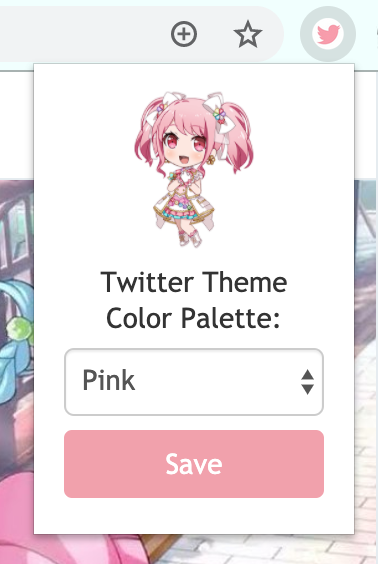
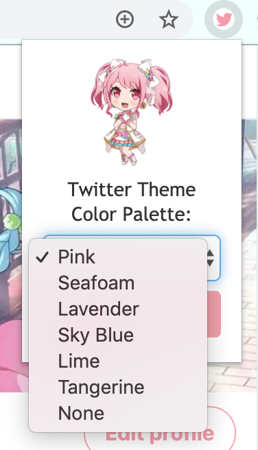

<h1 align="center">Pastel Palettes for Twitter</h1>

<h4 align="center">
  Chrome extension for applying cute pastel color themes to Twitter's desktop site ≧◡≦
</h4>

 

## Extension Interface 

   
  

 
## Samples

  
  

